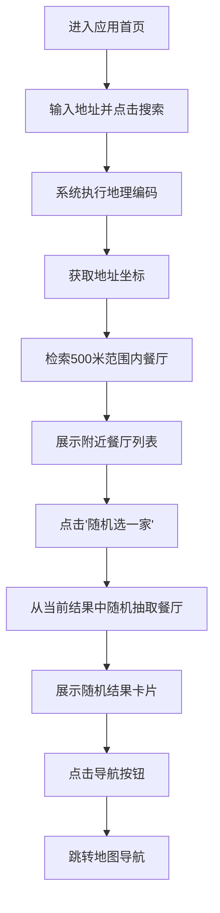

## 1. 产品概述
“等会儿吃什么”是一个面向手机端的轻量餐厅决策应用，用户输入任意地址后，可查看该地址 500 米范围内的餐厅，并通过随机选择功能快速决定吃什么。
- 核心目标是降低“吃什么”决策成本，把“搜索地址 → 看附近餐厅 → 随机选一家 → 直接导航”压缩到一个顺滑流程中。
- 产品价值在于高频、低学习成本、强即时性，适合午餐、晚餐、外出办事、到陌生商圈等场景快速使用。

## 2. 核心功能

### 2.1 用户角色
本产品无需区分角色，默认所有用户均为匿名访客。

### 2.2 功能模块
1. **首页**：地址搜索、附近餐厅列表、随机选择按钮、结果展示、导航入口。
2. **餐厅详情弹层**：展示被随机选中的餐厅信息、距离、地址、评分（如接口可提供）、导航按钮。

### 2.3 页面详情
| 页面名称 | 模块名称 | 功能说明 |
|-----------|-------------|---------------------|
| 首页 | 顶部标题区 | 显示产品名称、简短说明，强调“帮你快速决定吃什么” |
| 首页 | 地址搜索栏 | 支持输入地址关键字，点击搜索后发起地理编码 |
| 首页 | 地址确认卡片 | 展示当前解析后的地址名称与坐标状态，告知搜索基准点 |
| 首页 | 餐厅列表区 | 拉取并展示 500 米范围内餐厅，支持名称、距离、地址、评分等信息 |
| 首页 | 随机选择按钮 | 用户点击后，从当前餐厅结果中随机抽取一家 |
| 首页 | 随机结果卡片 | 高亮展示选中的餐厅，给出“就吃这家”结果和基础信息 |
| 首页 | 导航按钮区 | 支持跳转系统地图/高德地图导航到目标餐厅 |
| 首页 | 状态反馈区 | 展示加载中、无结果、搜索失败、定位失败等状态 |
| 餐厅详情弹层 | 餐厅信息 | 展示餐厅名称、距离、地址、类型、营业状态等 |
| 餐厅详情弹层 | 导航操作 | 点击后拉起导航链接，优先高德地图，保留 Web 兼容跳转 |

## 3. 核心流程
用户进入页面后，先输入一个地址并搜索。系统将该地址转换为坐标，再基于该坐标检索 500 米范围内的餐厅。用户可以浏览列表，也可以直接点击“帮我随机选一家”。系统随机选中一家餐厅后，展示结果卡片，并提供导航入口，方便用户直接前往。

## 4. 用户界面设计

### 4.1 设计风格
- 主色：活力橙黄、奶油白、深墨黑，强调“轻松决定、快速行动”
- 辅色：清爽蓝绿用于信息提示和导航状态
- 按钮风格：大圆角、高对比、适合手指点击的移动端按钮
- 字体建议：中文使用有个性但易读的无衬线标题字搭配清晰正文
- 布局风格：移动端卡片式单栏布局，重点操作固定在拇指易触区域
- 图标风格：圆润、轻松、偏生活化，降低工具感

### 4.2 页面设计概览
| 页面名称 | 模块名称 | UI 元素 |
|-----------|-------------|-------------|
| 首页 | 顶部标题区 | 大标题、简短说明、副标题、轻量情绪化插图 |
| 首页 | 地址搜索栏 | 圆角输入框、定位/搜索图标、搜索按钮 |
| 首页 | 餐厅列表区 | 单列信息卡片、距离标签、餐厅分类标签、空状态插画 |
| 首页 | 随机选择按钮 | 底部大按钮、吸睛配色、点击后带转盘/闪烁类反馈 |
| 首页 | 随机结果卡片 | 放大展示、动画弹出、重点突出名称与导航按钮 |
| 餐厅详情弹层 | 导航操作区 | 固定底部按钮、支持“一键导航”与“重新随机” |

### 4.3 响应式
- 明确采用移动端优先设计
- 默认适配主流手机宽度，兼容窄屏 Android 和 iPhone
- 桌面端作为适配延展，采用居中单列或双层卡片结构
- 所有关键按钮需满足手指点击热区，优先单手操作体验

