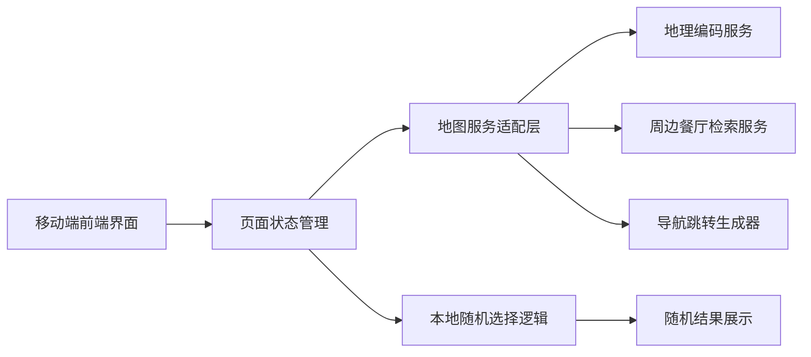
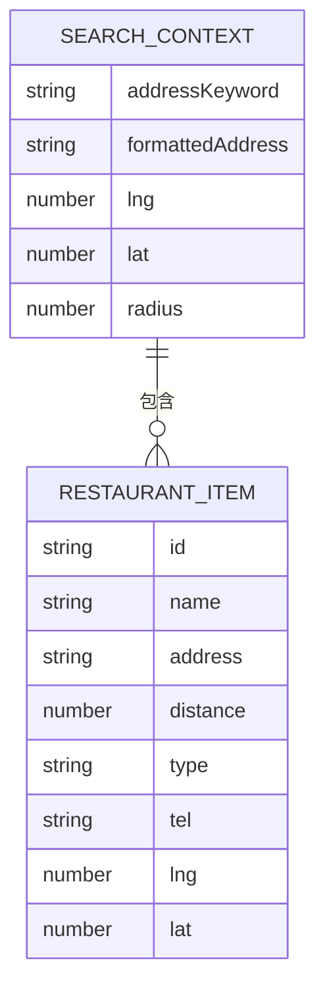

## 1. 架构设计



## 2. 技术说明
- 前端：React@19 + TypeScript + Vite + TailwindCSS@4
- 运行方式：单页前端应用，优先移动端浏览器体验
- 地图服务：高德地图 Web 服务 / JS API
- 状态管理：React Hooks 本地状态管理
- 网络请求：原生 `fetch`
- 配置方式：使用 `VITE_AMAP_KEY` 管理地图服务 Key

## 3. 路由定义
| 路由 | 用途 |
|-------|---------|
| / | 应用首页，完成地址搜索、餐厅展示、随机选择、导航跳转 |

## 4. API 定义

### 4.1 外部服务接口
1. **地理编码接口**
   - 用途：将用户输入的地址转换成经纬度
   - 输入：
   ```ts
   type GeocodeRequest = {
     address: string;
   };
   ```
   - 输出：
   ```ts
   type GeocodeResponse = {
     formattedAddress: string;
     location: {
       lng: number;
       lat: number;
     };
   };
   ```

2. **周边餐厅检索接口**
   - 用途：获取指定坐标 500 米范围内的餐厅
   - 输入：
   ```ts
   type NearbySearchRequest = {
     lng: number;
     lat: number;
     radius: 500;
     keywords: "餐饮服务";
   };
   ```
   - 输出：
   ```ts
   type RestaurantItem = {
     id: string;
     name: string;
     address: string;
     distance: number;
     type?: string;
     tel?: string;
     rating?: number;
     location: {
       lng: number;
       lat: number;
     };
   };

   type NearbySearchResponse = {
     restaurants: RestaurantItem[];
   };
   ```

3. **导航跳转生成**
   - 用途：根据选中的餐厅生成导航链接
   - 输入：
   ```ts
   type NavigationTarget = {
     name: string;
     lng: number;
     lat: number;
   };
   ```
   - 输出：
   ```ts
   type NavigationLink = {
     url: string;
   };
   ```

## 5. 服务架构说明
本项目默认不引入自建后端，优先采用纯前端 + 地图服务方案，以降低开发复杂度。前端通过地图服务适配层统一处理地理编码、周边搜索与导航链接生成，避免组件直接耦合第三方接口细节。若后续遇到 Key 暴露、配额控制或接口签名限制，再补充轻量代理服务。

## 6. 数据模型

### 6.1 数据模型定义


### 6.2 前端状态定义
```ts
type SearchContext = {
  keyword: string;
  formattedAddress: string;
  center: {
    lng: number;
    lat: number;
  } | null;
  radius: 500;
};

type AppState = {
  search: SearchContext;
  restaurants: RestaurantItem[];
  selectedRestaurant: RestaurantItem | null;
  loading: boolean;
  error: string | null;
};
```

## 7. 关键实现约束
- 搜索半径固定为 500 米，后续可扩展但首版不开放自定义
- 随机选择必须基于当前检索结果，不能脱离当前地址范围
- 导航跳转优先兼容高德地图移动端 Scheme / Web 链接
- 空状态、失败状态、无餐厅结果状态必须有明确提示
- 页面必须优先优化手机端单手操作与底部主按钮触达体验

